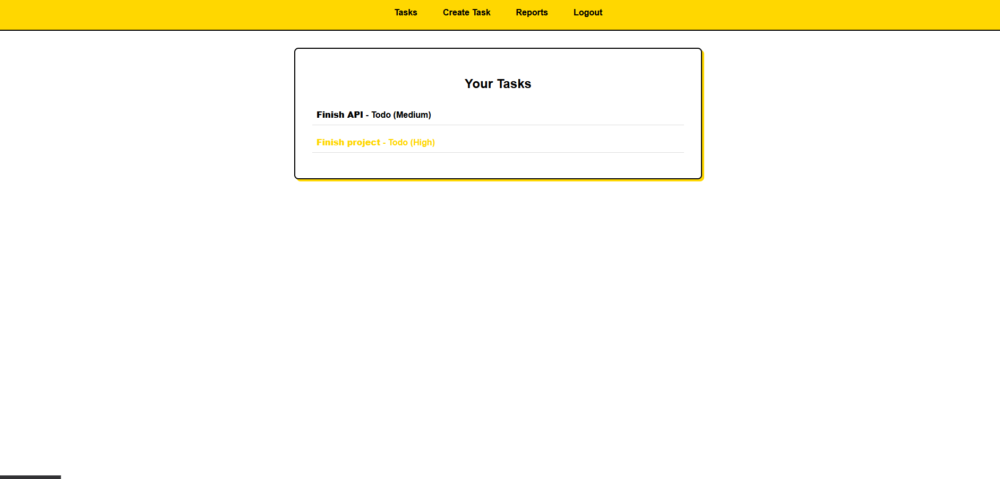

# Task Management System

Task Management System built with Django REST Framework, PostgreSQL, Redis, and Celery. A containerized full-stack application with both API and web interface access.

## 🚀 Quick Start

```bash
git clone https://github.com/apena-ba/task-management-system.git
cd task-management-system
cp .env.sample .env
docker-compose up
```

The application will be available at: **http://localhost:80**

To create an admin user for Django admin panel at `/admin`:
```bash
docker exec -it django bash
python3 manage.py createsuperuser
```

## 🏄 Application Navigation

### Web Interface
- **Login**: http://localhost/login/
- **Logout**: http://localhost/logout/
- **Register**: http://localhost/register/ 
- **Task List**: http://localhost/tasks/
- **Create Task**: http://localhost/tasks/create/
- **Reports**: http://localhost/reports/

### API Documentation
- **Swagger UI**: http://localhost/api/docs/ → Interactive API documentation
- **OpenAPI Schema**: http://localhost/api/schema/ → Raw API schema

### Screenshots




## 👨‍💻 Technology Stack

- **Backend**: Django 5.2, Django REST Framework
- **Database**: PostgreSQL 15
- **Cache & Queue**: Redis 7
- **Background Tasks**: Celery with Beat scheduler
- **Frontend**: Django Templates (Server-side rendering)
- **Containerization**: Docker & Docker Compose

## 🐳 Services

The application runs 5 Docker containers:
- **Django**: Main application server (Port 80)
- **PostgreSQL**: Database server (Port 5432)
- **Redis**: Cache and message broker (Port 6379)
- **Celery Worker**: Background task processor
- **Celery Beat**: Scheduled task manager

## ⚙️ Development

### Prerequisites
- Docker & Docker Compose
- Git

### Environment Configuration
All configuration is handled through the `.env` file. Copy `.env.sample` to `.env` and adjust values as needed.

### Container Management
```bash
# Start all services
docker-compose up

# Run in background
docker-compose up -d

# View logs
docker-compose logs [service_name]

# Stop services
docker-compose down

# Stop services and remove volumes and images
docker-compose down --volumes --rmi all

# Rebuild containers
docker-compose up --build
```

### Database Operations
```bash
# Run migrations
docker exec -it django python3 manage.py migrate

# Create superuser
docker exec -it django python3 manage.py createsuperuser

# Django shell
docker exec -it django python3 manage.py shell
```

## 🔧 Testing

Basic API testing can be performed through the Swagger UI at `/api/docs/`. For comprehensive testing:


## 📖 Documentation

Comprehensive project documentation is available in the `docs/` directory:

- **[API_DOCUMENTATION.md](docs/API_DOCUMENTATION.md)**
- **[ARCHITECTURE.md](docs/ARCHITECTURE.md)**
- **[DECISIONS.md](docs/DECISIONS.md)**

## 🏢 Project Structure

```
task-management-system/
├── docker-compose.yml          # Container orchestration
├── .env.sample                 # Environment variables template
├── django_backend/             # Django application
│   ├── Dockerfile             # Django container image
│   ├── config/                # Project configuration
│   ├── apps/                  # Application modules
│   └── scripts/               # Container scripts
├── docs/                      # Project documentation
│   ├── API_DOCUMENTATION.md
│   ├── ARCHITECTURE.md
│   └── DECISIONS.md
└── shared/                    # Shared volume for file storage
```
