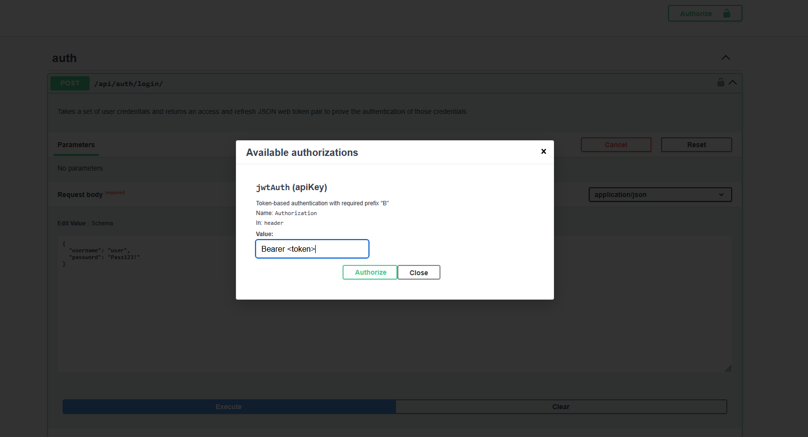

# Task Manager API Documentation

REST API for managing tasks, users, authentication, and comments  
To access the visual UI docs, visit `http://<host>/api/docs/`

## 🔑 Authentication

### POST /api/auth/register/
To register a user call the endpoint and provide `username` `email` `password`. The field `team` is optional.
```json
{
  "username": "user",
  "email": "user@example.com",
  "password": "Pass123!",
  "team": 1
}
```

### POST /api/auth/login/
Authenticate a user and obtain JWT tokens.
```json
{
  "username": "user",
  "password": "Pass123!"
}
```
Use the obtained `access_token` to authenticate including it in the HTTP header `Authorization: Bearer <token>`

> 💡 In Swagger, use the authorize button and paste the token after writing Bearer



After setting the token in the authorize section, Swagger will be able to authenticate over all the routes.

### POST /api/auth/refresh/
Refresh an expired access token using a valid refresh token.
```json
{
  "refresh": "your_refresh_token_here"
}
```
**Response:**
```json
{
  "access": "new_access_token",
  "refresh": "refresh_token"
}
```

### POST /api/auth/logout/
Logout the current user (invalidates tokens).
- Requires authentication
- No request body needed

## 👤 Users

The following routes allow getting / modifying information about users:

- **GET /api/users/** → Get a list of users. Allows pagination.
- **GET /api/users/{id}/** → Get information about 1 user. Expects a numeric value.
- **GET /api/users/me/** → Gives information about the user sending the request.

---

- **PUT /api/users/{id}/**
    + Modifies a users data
    + Expects a numeric value

Accepts the following body:
```json
{
  "username": "user2",
  "email": "user2@example.com",
  "first_name": "Joao",
  "last_name": "Neves"
}
```

## 🗹 Tasks

The following routes allow creating, modifying and getting information about tasks.

- **GET /api/tasks/**
    + Retrieve a list of tasks.
    + Supports pagination, filtering, and search

Query parameters:
```yml
assigned_to: filter by assigned user ID
created_by: filter by creator ID
due_date_after: filter tasks due after this date
due_date_before: filter tasks due before this date
priority: low, medium, high
status: todo, in_progress, done
title: case-insensitive search by title
search: full-text search in tasks
ordering: field to order by
page: page number
Response: Paginated list of tasks.
```

- **POST /api/tasks/**
    + Creates a new task
    + Mandatory parameters are `title` `description` `status` `priority` `due_date` `estimated_hours`

Expected body:
```json
{
  "title": "Task title",
  "description": "Task details",
  "status": "todo",
  "priority": "medium",
  "due_date": "2025-09-09T12:00:00Z",
  "estimated_hours": "5.00",
  "assigned_to_ids": [1, 2],
  "tags": [1, 2],
  "parent_task": 1
}
```

- **GET /api/tasks/{id}/**
    + Get information about a task
    + Expects a numeric value

- **PUT /api/tasks/{id}/**
    + Update a complete task
    + Expects a numeric value
    + Uses the same body structure as POST

- **PATCH /api/tasks/{id}/**
    + Partially update a task
    + Expects a numeric value
    + All fields are optional

Example PATCH body:
```json
{
  "status": "in_progress",
  "actual_hours": "3.50"
}
```

- **DELETE /api/tasks/{id}/**
    + Delete a task
    + Expects a numeric value
    + Returns 204 No Content on success

### Task Assignment

- **POST /api/tasks/{id}/assign/**
    + Assign users to a specific task
    + Expects a numeric task ID

Request body:
```json
{
  "assigned_to_ids": [1, 2, 3]
}
```

## 💬 Comments

Comments are associated with specific tasks and allow team collaboration.

- **GET /api/tasks/{id}/comments/**
    + Get all comments for a specific task
    + Supports pagination
    + Expects a numeric task ID

Query parameters:
```yml
page: page number for pagination
```

- **POST /api/tasks/{id}/comments/**
    + Add a comment to a specific task
    + Expects a numeric task ID

Request body:
```json
{
  "content": "This is a comment on the task"
}
```

**Comment Response Structure:**
```json
{
  "id": 1,
  "task": 5,
  "content": "This is a comment on the task",
  "created_by": {
    "id": 1,
    "username": "user",
    "email": "user@example.com",
    "first_name": "John",
    "last_name": "Doe"
  },
  "created_at": "2025-09-09T12:00:00Z"
}
```

## 📊 Data Models

### Task Status Options
- `todo` - Task pending to be done
- `in_progress` - Task in progress  
- `done` - Completed task

### Priority Levels
- `low` - Low priority
- `medium` - Medium priority
- `high` - High priority

### Task Fields
- `title` (required, max 200 chars)
- `description` (required)
- `status` (required, enum)
- `priority` (required, enum)
- `due_date` (required, ISO 8601 datetime)
- `estimated_hours` (required, decimal up to 999.99)
- `actual_hours` (optional, decimal up to 999.99)
- `assigned_to_ids` (array of user IDs)
- `tags` (array of tag IDs)
- `parent_task` (optional, for subtasks)
- `metadata` (flexible JSON field)
- `is_archived` (boolean, default false)

## 🔒 Security

All endpoints except `/api/auth/register/` and `/api/auth/login/` require authentication via JWT tokens.

### Authentication Methods
- **Bearer Token**: Include in Authorization header as `Bearer <token>`
- **JWT Auth**: Token-based authentication with "B" prefix

### Error Responses
- `401 Unauthorized` - Invalid or missing token
- `403 Forbidden` - Insufficient permissions
- `404 Not Found` - Resource not found
- `400 Bad Request` - Invalid request data
- `422 Unprocessable Entity` - Validation errors

## 📄 Pagination

List endpoints return paginated results with the following structure:
```json
{
  "count": 123,
  "next": "http://api.example.org/tasks/?page=4",
  "previous": "http://api.example.org/tasks/?page=2",
  "results": [...]
}
```

## 🏷️ Teams

Users can belong to teams, which is useful for task assignment and organization:
- Teams have a `name` and an optional `lead` (user ID)
- Users are assigned to teams during registration or via user updates
- Team information is included in user responses